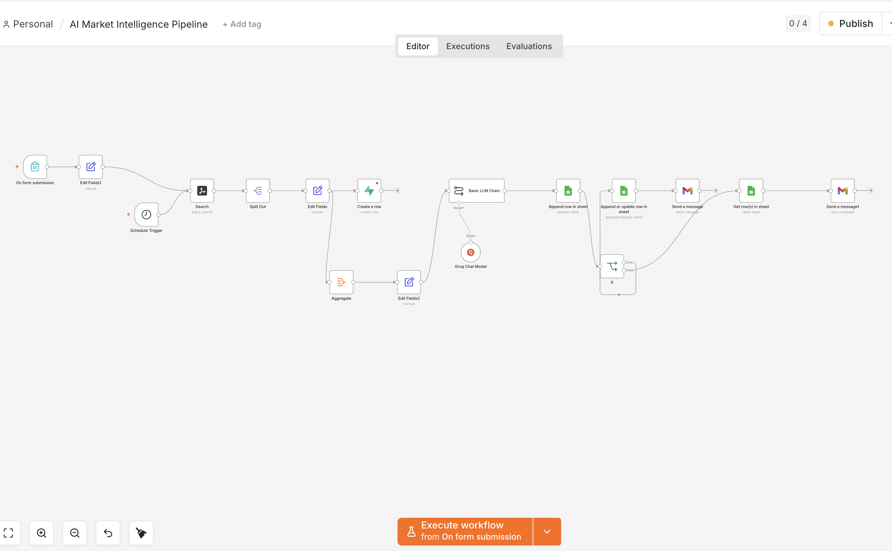

# AI Market Intelligence Pipeline

> Built by **Anmisha Mandalapu** | anmishamandalapu@gmail.com  | Linkedin: www.linkedin.com/in/anmisha-mandalapu

An automated, end-to-end market intelligence pipeline that ingests live AI industry news, analyzes it with a large language model, and delivers 7 structured intelligence signals by email — personalized to a subscriber's chosen sector, on demand or on a 48-hour schedule.

---

## Live Demo

The pipeline is running in production. To receive a personalized report:

1. Open the form → **https://anmisha.app.n8n.cloud/form/15e16f9e-ee75-4715-a5cf-334dc40cfeb4**
2. Select your sector and enter your email
3. Receive 7 AI intelligence signals in your inbox within ~60 seconds

---

## Architecture




**Execution paths:**
- **Form run:** sector-targeted search → grounded analysis → save subscriber (email + sector) → email the requester only
- **Schedule run (every 48 hours):** general AI news search → grounded analysis → read subscriber list → email everyone

---

## Key Design Decisions

**1. Personalization starts at the data source.**
The Tavily search query is dynamic — form runs search for news specific to the user's selected sector before anything reaches the AI. Sector personalization is not just prompt-level; it starts at ingestion.

**2. Storage is a parallel dead-end branch.**
The Supabase node has no outgoing connection. Storage and analysis run in parallel from the same data; a database failure or full set of duplicate rejections never blocks email delivery.

**3. Sector re-injection before analysis.**
In n8n, nodes only pass forward what they output — the sector captured at the form is dropped at the search step. A dedicated Set node immediately before the LLM re-attaches it from the form node by name, ensuring the prompt always knows which industry it is writing for.

**4. Grounded prompting with verified output.**
The LLM prompt opens with explicit grounding rules: use only the supplied articles; never invent companies, people, quotes, or figures; describe trends generally when the data lacks specifics. Every specificity instruction in the signal definitions is conditional on what appears in the data. During testing, a data-drop bug caused the model to fabricate a complete report with real-sounding but unsourced experts — the grounding rules were the fix, and output is now verified by tracing every named entity back to a source article.

**5. Classified error handling.**
Failures are categorized, not suppressed. Duplicate rejections from Supabase are expected and harmless — Continue on Error. Tavily search failures and LLM failures stop the pipeline entirely — Stop Workflow — because no email is better than a fabricated one. Every failure is visible in the n8n execution log.

**6. Dual-trigger routing via If node.**
A single If node checks which trigger started the run (`$('On form submission').isExecuted`). Form runs save the subscriber and email only the requester; scheduled runs broadcast to the full list. Without this, a sector-specific form report would go to every subscriber, and scheduled runs would attempt to write nonexistent form data to the subscriber list.

---

## Tech Stack

| Tool | Purpose | Why Chosen |
|------|----------|------------|
| n8n | Pipeline orchestration | Visual workflow builder — fast integration of all layers, trigger-aware expressions, and visual debugging that makes execution issues immediately visible |
| Tavily API | Data ingestion | Real-time AI web search with structured output — sector-targeted queries, pre-summarized content, relevance scores per article |
| Supabase (PostgreSQL) | Persistent storage | Production-grade Postgres — SQL unique constraint for deduplication, scales beyond spreadsheets, builds historical signal record |
| Groq (LLaMA 3.3 70B) | AI signal generation | Fast, free inference — generates 7 structured, grounded signals per run; model is swappable with a config change |
| Google Sheets | Signal log + subscriber list | Accessible output — stakeholders review signals and subscriber data without login or tooling |
| Gmail | Email delivery | Most accessible delivery channel — reports arrive directly in inbox |
| n8n Form | User onboarding | Hosted web form — sector selection and subscription with no code |

---

## Sample Output


**Note on signal quality**: Signal specificity varies by sector and date depending on what Tavily finds on that day. When breaking news exists, signals are highly specific with named companies and figures. When less breaking news exists, grounding rules prevent fabrication and signals describe general trends instead. Accuracy is always prioritized over specificity.

> *The following signals were generated from real Tavily search results for the Media & Entertainment sector. Every named entity traces to a source article.*

1. **SECTOR SIGNAL**: The Media & Entertainment industry is being directly affected by AI developments, such as generative AI, which can create high-quality content faster and at lower costs. Companies like OpenAI are at the forefront of this development, with products like ChatGPT.

2. **INVESTMENT SIGNAL**: AI investment in Media & Entertainment is expected to have a significant impact, with generative AI likely to be adopted by both scaled incumbents and new entrants. However, specific deals, acquisitions, or funding rounds are not mentioned in the data.

3. **ADOPTION SIGNAL**: Professionals in Media & Entertainment can use AI developments to improve their work and productivity by leveraging generative AI for content creation, curation, and personalization. For example, AI can be used to produce high-quality content faster and at lower costs.

4. **FUTURE SIGNAL**: In the next 6-12 months, the Media & Entertainment sector can expect AI changes such as the increased use of generative AI in production and distribution, as well as a focus on AI-assisted solutions for audiences. Businesses should prepare by exploring the potential of generative AI and its applications in their industry.

5. **EVOLUTION SIGNAL**: To stay competitive, businesses and professionals in Media & Entertainment should evolve their strategy by embracing generative AI and exploring its potential applications. They should also focus on developing bespoke AI-assisted solutions for their audiences and consider content deals with AI platforms.

6. **LEADERSHIP SIGNAL**: Industry leaders and experts, such as Benjamin Swinburne from Morgan Stanley and Ezra Eeman, Strategy and Innovation Director at NPO, believe that generative AI will have a significant impact on the Media & Entertainment industry, both as an opportunity and a risk. They emphasize the need for companies to adapt to the changing landscape and explore the potential of generative AI.

7. **TOOLS & TIPS SIGNAL**: Media & Entertainment professionals should be aware of AI tools like ChatGPT and other generative AI platforms that can be used for content creation, curation, and personalization. They should also consider attending events like The AI Summit to connect with AI leaders and innovators and stay up-to-date on the latest developments in the field.


> *The following signals were generated from real Tavily search results for the Finance sector. Every named entity traces to a source article.*

1. **SECTOR SIGNAL**: AI developments are directly affecting the Finance industry today, with advancements in Generative AI and large language models expanding the range of possible applications, including customer interaction, internal analysis, and supervisory processes. Companies such as J.P.Morgan and Bank of America are leveraging AI to improve efficiency and reduce fraud.

2. **INVESTMENT SIGNAL**: AI investment and funding are flowing into the Finance sector, with a focus on developing and implementing AI solutions to improve operations, risk management, and customer experience. The U.S. Department of the Treasury has released a report on the uses, opportunities, and risks of AI in financial services, highlighting the need for continued stakeholder engagement to foster innovation while mitigating potential risks.

3. **ADOPTION SIGNAL**: Professionals in Finance can use AI developments to improve their work and productivity by leveraging AI to analyze customer behavioral patterns, perform customer segmentation, and detect fraud. AI can also be used to automate back-office functions, support credit underwriting, and manage risks.

4. **FUTURE SIGNAL**: Based on the data, AI changes are coming to the Finance sector in the next 6-12 months, with a focus on the strategic deployment of Generative AI to reimagine operations, product development, and risk management. Businesses should prepare by investing in AI solutions, developing governance frameworks, and ensuring accountability, risk management, and oversight.

5. **EVOLUTION SIGNAL**: Businesses and professionals in Finance should evolve their strategy to stay competitive by incorporating AI into their operations, leveraging data to improve customer experience, and developing new operating models. They should also focus on building partnerships and ecosystems, accommodating cross-border compliance, and ensuring multimarket adaptability.

6. **LEADERSHIP SIGNAL**: Industry leaders and experts, such as Under Secretary for Domestic Finance Nellie Liang and Andrew W. Lo, a professor of finance at the MIT Sloan School of Management, are emphasizing the importance of understanding the impact of AI on the financial sector. They highlight the need for continued stakeholder engagement, governance frameworks, and risk management to mitigate potential risks and foster innovation.

7. **TOOLS & TIPS SIGNAL**: Finance professionals should be aware of AI tools such as large language models and Generative AI, which can be used to improve efficiency, reduce fraud, and enhance customer experience. They should also focus on developing skills to work with AI, understanding data governance, and ensuring accountability and oversight in AI operations.


## Limitations & Roadmap

**Per-sector scheduled delivery** — subscribers select a sector at signup and it is stored, but scheduled broadcasts currently use general AI news for everyone. The designed next step is looping the scheduled run per sector: one search, one analysis, one targeted email per sector group.

**Historical trend analysis** — Supabase is currently write-only by design: every article is stored with deduplication enforced, but no node reads the history back yet. The next step is a read node pulling the last week of signals into the prompt so each report can include trend context ("investment mentions up 40% since last week").

**Relevance score filtering** — Tavily returns a relevance score per article (0 to 1). Currently all articles pass to Groq regardless of score. A filter node after Edit Fields would drop low-scoring articles below a threshold (e.g. 0.7), ensuring only the most relevant content reaches the AI 
analysis layer.

**News freshness** — sector-specific queries sometimes return evergreen explainer articles rather than dated news. Tuning Tavily's search parameters toward news mode and recency filters is a known lever for sharper results.

**Email delivery at scale** — Gmail has a 500 email per day sending limit. At scale, the Gmail node would be replaced with AWS SES — available as a native n8n node — which handles millions of emails at ~$0.10 per 1,000. The pipeline architecture stays identical; only the delivery infrastructure 
changes.

**AI Tools Guide signal** — A planned 8th signal category would curate 2-3 specific AI tools from the news data each run, explaining what each tool does, who it is for, and how professionals in the subscriber's sector can use it immediately. This makes the report useful for anyone beginning their AI journey, not just professionals already familiar with the space.

----
## How to Run

### Prerequisites
- n8n account (cloud or self-hosted)
- Tavily API key — [tavily.com](https://tavily.com)
- Groq API key — [console.groq.com](https://console.groq.com)
- Supabase project with a `ai_market_signals` table
- Google account (Sheets + Gmail via OAuth2)

### Supabase Table Setup
```sql
CREATE TABLE ai_market_signals (
  id SERIAL PRIMARY KEY,
  url TEXT UNIQUE,
  title TEXT,
  content TEXT,
  score FLOAT,
  created_at TIMESTAMP DEFAULT NOW()
);
```

### n8n Import
1. Download `workflow/pipeline.json`
2. In n8n: **Workflows → Import from file**
3. Add your credentials (Tavily, Groq, Supabase, Google OAuth2)
4. Replace placeholder Sheet URLs with your own Google Sheet
5. Activate the workflow — the production form URL appears in the On Form Submission node

### Google Sheet Structure
- Sheet 1: `AI trends` — columns: Signals, Timestamp
- Sheet 2: `Subscriber emails` — columns: Emails, Sector
